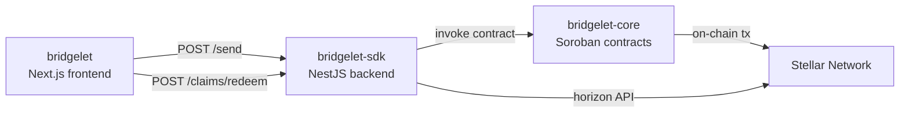

# Architecture Overview

## System Flow

## Components

### bridgelet (frontend)
Next.js app serving the sender send-flow and recipient claim flow.

### bridgelet-sdk
NestJS service managing ephemeral account lifecycle, claim authentication, and webhook delivery.

### bridgelet-core
Soroban smart contracts enforcing on-chain restrictions: funding source, amount cap, expiry, and sweep.

### Stellar Network
The bridgelet-core contracts run on Stellar's Soroban environment (testnet and mainnet).
