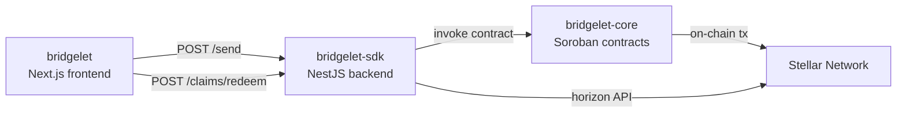

# Architecture Overview

## System Flow

## Components

### bridgelet (frontend)
Next.js app serving the sender send-flow and recipient claim flow.

### bridgelet-sdk
NestJS service managing ephemeral account lifecycle, claim authentication, and webhook delivery.

### bridgelet-core
Soroban smart contracts enforcing on-chain restrictions: funding source, amount cap, expiry, and sweep.

### Stellar Network
The bridgelet-core contracts run on Stellar's Soroban environment (testnet and mainnet).

## Trust Boundary & Authentication

The frontend never talks to `bridgelet-sdk` with a credential directly from
the browser. The trust boundary is:

- **Unguarded SDK routes** (`/claims/verify`, `/claims/redeem`) require no
  credential, so the browser calls `bridgelet-sdk` directly using the
  client-safe `NEXT_PUBLIC_API_BASE_URL`.
- **Guarded SDK routes** (`/accounts`, `/accounts/prepare`, `/accounts/:id`)
  require a Bearer token. The browser never holds this token — it calls this
  app's own `/api/accounts/*` Route Handlers (see
  `frontend/app/api/accounts/`), which attach `BRIDGELET_SDK_TOKEN`
  server-side before forwarding the request to `bridgelet-sdk`.
- Any new frontend code that needs an authenticated `bridgelet-sdk` call
  must add or reuse a server-side Route Handler rather than calling the SDK
  with a credential from client code. Environment variables prefixed
  `NEXT_PUBLIC_*` are inlined into the browser bundle and must never hold a
  secret or API key — see `frontend/.env.example` for the client-safe vs.
  server-only split.